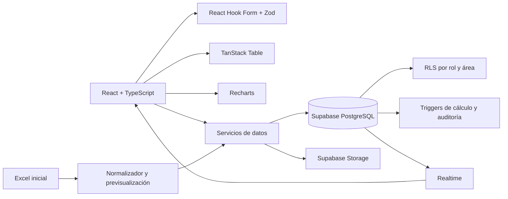

# Arquitectura

## Flujo principal

## Decisiones

- PostgreSQL es la única fuente de verdad en producción.
- Los valores derivados (`semaforo`, días y riesgo) se calculan en base de datos para evitar diferencias entre clientes.
- El frontend también calcula el semáforo para el modo demo y para respuesta visual inmediata.
- El historial se genera en trigger y no depende de que el cliente recuerde registrarlo.
- Los responsables conservan campos de texto, pero el esquema incluye referencias opcionales a `profiles`.
- La aplicación arranca sin Supabase para facilitar revisión, pero activa login y datos remotos al detectar variables de entorno válidas.
